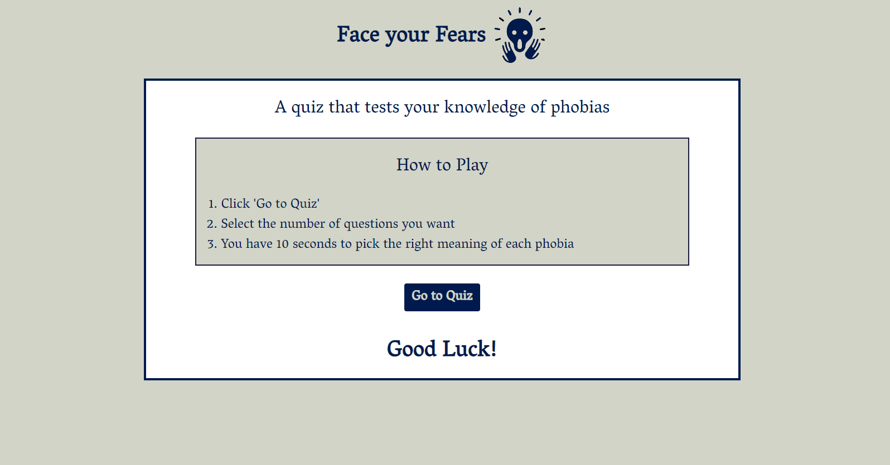
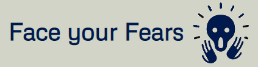

# **Face Your Fears - A Quiz about Phobias**
Phobias are a common pub quiz category and this quiz was designed to give players an easy and fun way to test their knowledge of the definitions of phobias.  

## Visit the deployed website

## User Experience (UX)
A player would want to test their knowledge of phobias' definitions.
On visiting the site they should be able to 
1. Understand what the quiz is about.
2. Understand how to start play.
3. Understand how to pick how many questions they want to answer in the quiz.
4. Understand how to answer the questions.
5. Understand when they answer correctly.
6. See the correct answer if they answer incorrectly.
7. Follow their progress through the quiz.
8. Understand their performance on the final page.
9. Be able to play again or quit the game at the end.
## Strategy
The quiz should be a simple and attractive design with sufficient interactivity to engage players of any age or ability.

Objective Requirement;         To get players to play the quiz and to want to return again in the future.

Functional requirements; 	    To provide a bank of relevent questions, a means of the players testing themselves, a means of recording players progress through the quiz, a means of recording and displaying their score, a means of indicating how much time they have remaining on each question. A way to display correct answer if they answer incorrectly. A way to display the final result.

Non-functional requirements; 	The quiz should be simple, attractive and intuitive to facilitate players of any age or technical ability.
## Structure
The quiz will have 3 pages, A welcome page, a quiz page and a page for the final result. The quiz should automatically usher the player through all the stages of the quiz once they start through to the end. At the end they should be able to quit or replay.
## Skeleton
The welcome page  explains what the quiz is about and how to play and a button to get started. 
The quiz page starts with the player picking how many questions they want to answer. It then displays a question, 4 answer options,  a progress bar, a score tally and a timer. Once the player selects an answer the quiz will indicate if it is correct or incorrect by changing the background colour, update the score, progress bar and reset the timer It will display the correct answer if the answer was incorrect and will continue to display a new questions until the player has answered the number of questions they initially selected.
The links to the wireframes can be accessed [here](assets/images/wireframes.pdf). 
## Surface/Design
### Imagery
The overall image of the site was to be kept clear, simple and intuitive.
### Colour scheme
It was important to keep the colour scheme of the quiz extremely simple. Information on the [psychology of colours](https://www.vandelaydesign.com/the-psychology-of-color-in-web-design/) in website design indicates that blue can help convey trustworthiness and so a dark shade of blue was picked for the font. A [minimum contrast ratio](https://developer.mozilla.org/en-US/docs/Web/Accessibility/Understanding_WCAG/Perceivable/Color_contrast) of 4.5:1 for small text and 3:1 for large text is recommended. This site wanted a strong but not too stark contrast. The contrast ratio of the site is [11.14](assets/images/contrastratio.png). 
### Typography
Information on the [psychology of fonts](https://fabrikbrands.com/font-psychology-and-typography-inspiration-in-logo-design) indicated that a serif font can  convey trust and respectability. With this in mind the Vesper Libre font was selected in [Google Fonts](https://fonts.google.com/) for its simplicity.
## Features
- Responsiveness on all device sizes.
- A button on first page to bring the player to the quiz page.
- An input at the start of the quiz to allow the player to select the number of questions they want to answer up to a maximum of 20.
- A means of the quiz only displaying after player has selected a number of questions between 1 and 20.
- An alert if player tries to pick anything other than a number between 1 and 20.
- A means of displaying a random question and four answer options from the question bank and then removing that question from the question bank to avoid duplication.
- A means of capturing the players response to the question, checking if it is correct and feeding that information to the score tally.
- A means of displaying the correct answer if the player answers incorrectly.
- A means of displaying the player's progress through the quiz that updates after each question.
- A means of displaying the player's score through the quiz that updates after each question.
- A means of displaying the player's time remaining for each question. 
- A means of the quiz moving on to the next question after 10 seconds if player doesn't answer.
- A means of displaying the final result and a button to allow the player to play again or quit.
## Future features
In the future the site could link to an API to provide the questions rather than having a large question bank on the site. A high score section could be included. 
## Languages used
[HTML5](https://en.wikipedia.org/wiki/HTML5)

[CSS](https://en.wikipedia.org/wiki/CSS)

[JavaScript](https://en.wikipedia.org/wiki/JavaScript)
## Frameworks, Libraries and online resources used
- [Balsamiq](https://balsamiq.com/wireframes/) was used to create the wireframes.
- Gits's [gitpod](https://www.gitpod.io/) was used for writing and editing code, and for submitting and pushing to GitHub.
- [GitHub](https://github.com/) was used for storing the code after being pushed from Git.
- [Bootstrap 5.0.1](https://getbootstrap.com/) was used for responsiveness and styling.
- [Google Fonts](https://fonts.google.com/) was used to choose and import the font.
- The colour palette was generated using [coolors.co](https://coolors.co/).
- Foreground/Backgound contrast was checked using [contrast-ratio.com](https://contrast-ratio.com/). 
- The favicon was downloaded from [favicon.io](https://favicon.io/favicon-generator/) and originated from [twemoji](https://twemoji.twitter.com/).
- The logo was created on [zyro.com](https://logo.zyro.com/).
- The following tutorials from [James Q Quick](https://www.youtube.com/playlist?list=PLDlWc9AfQBfZIkdVaOQXi1tizJeNJipEx), [Brian Design](https://www.youtube.com/watch?v=f4fB9Xg2JEY&t=2405s) and [codeexplained.org](https://www.youtube.com/watch?v=49pYIMygIcU) were followed in designing the features of the quiz.
- The following websites were used for problem solving [stackoverflow.com](https://stackoverflow.com/), [w3schools.com](https://www.w3schools.com/), [tutsmake.com](https://www.tutsmake.com/), [geeksforgeeks.org](https://www.geeksforgeeks.org/), [scrimba.com](https://scrimba.com/) and [teamtreehouse.com](https://teamtreehouse.com/community/why-does-jshint-give-me-these-warnings-about-es6).
- The code was formatted using [webformatter.com](https://webformatter.com/html).
- The phobias were found in [verywellmind.com](https://www.verywellmind.com/list-of-phobias-2795453).
- The fauxbias were found it [letterpile.com](https://letterpile.com/humor/Fun-Fictional-and-Humorousl-Phobias) and [inherentlyfunny.com](https://www.inherentlyfunny.com/cat-94-funny_phobias.html).

## Testing.
Bugs identified - during development and testing the bugs identified and corrected can be seen [here](assets/images/buglog).
### Validation
- HTML and CSS. All pages of the quiz were tested by direct input into [validator.w3.org](https://validator.w3.org/) for html and [jigsaw.w3.org](https://jigsaw.w3.org/css-validator/) for css and errors identified were corrected until no errors were showing in either validator. 
The javaScript in all the .js files was checked by direct input into [jshint](https://jshint.com/) and errors identified were corrected until no more corrections could be made. There were residual warnings about unused varaibles that has to be left as the variables were used in the code. The final jshint report can be viewed [here](assets/images/jshint).
- Lighthouse Audits. The quiz’s Performance, Accessibility, Best Practices and SEO were assessed by [Chrome Lighthouse](https://chrome.google.com/webstore/detail/lighthouse/blipmdconlkpinefehnmjammfjpmpbjk) and the results of this are [here](assets/images/TOBEADDED).
- Manual Testing. Extensive use was made of console.log() at every step of the functionality development and each time an error was noted it was addressed before proceeeding.
The quiz was tested on Google Chrome, Internet Explorer, Microsoft Edge and Safari browsers.
It was viewed on a variety of devices. Friends and family members reviewed the quiz to identify bugs and give feedback on user experience. The code was submitted for peer-review in Code Institute's peer-code-review channel in [slack.com](https://app.slack.com/). 
### Testing User Stories from User Experience (UX) Section.
1. Understand what the quiz is about;
    - On entering the site the player sees a welcome page with a title and an explanation of what the quiz is about.
2. Understand how to start play;
    - The welcome page includes instructions on how to play and a button that brings the player to the quiz page. 
3. Understand how to pick how many questions they want in the quiz;
    - Before displaying the quiz questions the quiz makes the player pick the number of questions they want to answer. Only when they have done this do the quiz questions appear. The maximum permitted is clearly displayed. If the player attempts to enter anything other than a number between 1 and 20 an alert displays.
4. Understand how to answer the questions;
    - The question is clearly displayed on the page and the four options appear like cards.
5. Understand when they answer correctly;
    - If the player clicks on the correct answer the background turns green. If they select an incorrect answer the background turns red. 
6. See the correct answer if they answer incorrectly;
    - If the player selects an incorrect answer the correct answer is displayed underneath the cards.
7. Follow their progress through the quiz;
    - The current and maximum question numbers display and there is a progress bar to indicate how far through the quiz the player has progressed.
8. Understand their performance on the final page;
    - When the quiz is over the final page gives they player their final score percentage with an appropriately attached message.
9. Be able to easily play again or quit the page at the end;
    The final results page has buttons to allow the player to quit or play again.
## Changes over course of development
Initially the site did not have a means of displaying the correct answer when a player answered incorrectly but following feedback from players it was decided to include this.
## Known Bugs
No errors displaying on console during use and no further bugs to those already identified and corrected.
## Deployment
### The project was deployed to GitHub Pages in the following way. 
1.	By logging in to the [GitHub Repository](https://github.com/).
2.	Selecting the "Settings" Button in the menu at the top of the Repository.
3.	Scrolling down the Settings page to the "GitHub Pages" Section.
4.	Under "Source", clicking the dropdown menu labelled "None" and selecting "Master Branch".
5.	The page then refreshes itself.
6.	Scrolling back down the page to locate the [link to the published site](https://conacbreslin.github.io/Face-your-fears/)  in "GitHub Pages".

### Forking the GitHub Repository
The  GitHub Repository can be forked to make a copy of the original repository on the GitHub account to view and/or make changes without affecting the original repository in the following way.
1.	By logging in to GitHub and locating the [GitHub Repository](https://github.com/ConacBreslin/Face-your-fears).
2.	Selecting the "Fork" button at the top of the Repository (it is located above the "Settings" Button and over to the right).
3.	There should then be a copy of the original repository in your GitHub account.

### Making a Local Clone
1.	By logging in to GitHub and locating the [GitHub Repository](https://github.com/ConacBreslin/Face-your-fears).
2.	Under the repository name, clicking the dropdown button marked “Code” and then selecting "Clone or download".
3.	Copying the link under "Clone with HTTPS", to clone the repository using HTTPS.
4.	Opening Git Bash.
5.	Changing the current working directory to the location where you want the cloned directory to be made.
6.	Typing git clone, and pasting the URL copied in Step 3.
7.	Pressing Enter to create the local clone.## Credits

## Acknowledgements
I would like to thank my mentor Chris Quinn whose advice is always perfectly judged.  
I would like to thank many tutors in Code Institute for being unfailingly helpful, patient and knowledgeable and without whom I never would have got this far.   
I would like to thank Aukje van der Wal from Code Institute for her [excellent presentation](https://us02web.zoom.us/rec/play/MCuNmtPISEPZ8HKoaFOPfV0aK0lEW1PdPp4oOc6qMgDKZJlM8R25CeYN9px-Sl5Igy9MH6t84U91Qqb0.TLaMAiPKcepOyIei?startTime=1613671536000&_x_zm_rtaid=Yutxy3GTQ6aVY5AYPIL9pw.1621494089473.7c91fa9f055bf41582324f20a1697373&_x_zm_rhtaid=590) on preparation for MS2 projects that helped me enormously is getting started.  
I would like to thank my fearless family and friends for all their support and feedback.

